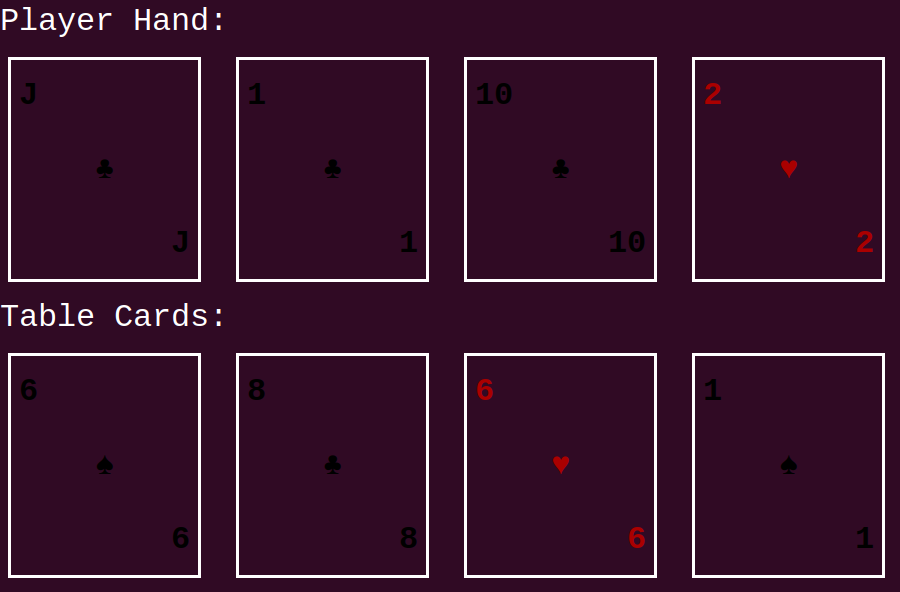

# Pasur (Terminal Edition)

A terminal-based implementation of the traditional Persian card game **Pasur**, written in modern C++. This version focuses on clean game logic, AI simulation, and turn-based gameplay between a human player and a CPU opponent.

---

## 🃏 Game Overview

Pasur is a two/four-player card game where players collect cards from the table based on specific rules involving matching ranks or making sums of 11 with number cards. It involves strategy, memory, and a bit of luck.

---

## 🎮 Gameplay Rules

- The game uses a standard 52-card deck.
- Players alternate turns by playing a card from their hand.
- Cards can **capture** cards from the table as follows:
  - **Number cards (2–10):** Can capture one or more cards from the table whose total value equals **11 - played card’s value**.
  - **Jack (J):** Captures **all table cards** _except_ Kings and Queens.
  - **Queen (Q) or King (K):** Captures **only** the matching rank card from the table (e.g., King captures King).
- If a player clears the table (and it's not a simulation), they get a **Soor** bonus (+5 points).
- If no capture is made, the played card is placed on the table.

---

## 🧮 Scoring

At the end of the round, players earn points based on their collected cards:

| Card Type              | Points                                |
| ---------------------- | ------------------------------------- |
| Each **Ace**           | 1                                     |
| Each **Jack**          | 1                                     |
| **10 of Diamonds**     | 3                                     |
| **2 of Clubs**         | 2                                     |
| **Clubs (total = 13)** | If player has ≥ 7, they earn 7 points |

Soor bonus: **+5 points** per successful Soor (table sweep. Doesn't apply to Jack).

---

## 🧰 Features

- Turn-based gameplay with human vs CPU
- Unit testing for core logic
- Simulated CPU hand logic
- Multiple combination detection for sum-11 captures
- Soor recognition and bonus
- Card collection tracking and scoring
- Modular, readable C++ code

---

## 🖼️ Screenshot

Here's a preview of the game running in the terminal:

---

## 🚀 Future Improvements

- Online multiplayer

---

## 📜 License

MIT License. Feel free to use, modify, and distribute.
